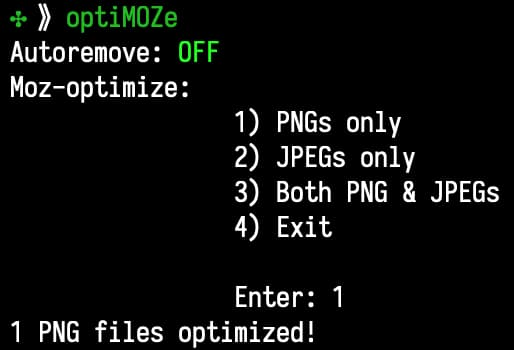
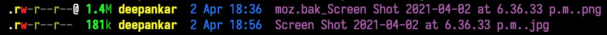

# optiMOZe - a shell script to encode with mozjpeg

### What is optiMOZe ?

I got the idea to write `optiMOZe`, which is a shell script to automatically compress random JPEG and PNGs lying around my mac (like screenshots, image exports for powerpoint etc.) after I tried [MOZjpeg](https://github.com/mozilla/mozjpeg) on google's [squoosh app](https://squoosh.app) to compress some images for [my blog](https://blog.dchakro.com). I was blown away by the compression ratio and looking at the images side by side. Try `optiMOZe` for yourself, I'll let the images on your computer do the talking.

P.S. the name optiMOZe is a play on the word optimise: *optimise -> optimize -> optimoze*.

### Dependencies

`optiMOZe` is basically a wrapper around two very well built pieces of software: [imagemagick](https://github.com/ImageMagick/ImageMagick) & [MOZjpeg](https://github.com/mozilla/mozjpeg). You can get these on a mac from homebrew:

```sh
brew install imagemagick mozjpeg

# (see caveat #1) symlink mozjpeg
# Replace "4.0.3" in the path below with the vesion number of mozjpeg on your system.
ln -s /usr/local/Cellar/mozjpeg/4.0.3/bin/cjpeg /usr/local/bin/mozcjpeg
ln -s /usr/local/Cellar/mozjpeg/4.0.3/bin/jpegtran /usr/local/bin/mozjpegtran
```

**Tip**: `brew` doesn't maintain a log of its activity so if you want to keep a log, check out my simple tool [`brewlog`](https://github.com/dchakro/brewlog), which allows you to run a `brew` command of your choice while writing the output to a local log file.

To install these dependencies on other platforms follow instructions in their repos or official websites.

### How to use:

Just navigate to the folder where you want to encode images using mozjpeg and run `optiMOZe` (optiMOZe must be in your system path, otherwise use full path to optiMOZe).



+ The first line shows (reminds you) the status of autoremove. 
  + OFF = original file backed up as `moz.bak.<original.filename.png>`.
  + ON = original file will be removed automatically.
  + Ask = optiMOZe will ask you for confirmation for removing each file. Allows granular control.
+ Run `optiMOZe --help` to display the CLI args to use to control autoremove status.

### Caveats:

1. On a mac `MOZjpeg` is installed via [`homebrew`]((https://brew.sh)) but not symlinked to prevent conflicts with the standard `libjpeg`. So it is recommended to symlink cjpeg from MOZjpeg with a different name. I use `mozcjpeg` on my machines, which is the name used in the shell script. If you use a different name, just use Find-Replace or [sd](https://github.com/chmln/sd) on the shell script.

### Example of compression

I took a screenshot while writing this readme and was able to compress it with optiMOZe down to 13% of its original size.



