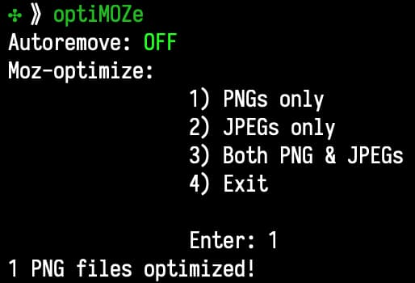
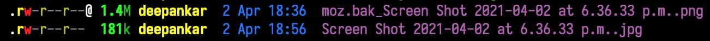

# optiMOZe - a shell script to encode with mozjpeg

### What is optiMOZe ?

I got the idea to write `optiMOZe`, which is a shell script to automatically compress random JPEG and PNGs lying around my mac (like screenshots, image exports for powerpoint etc.) after I tried [MOZjpeg](https://github.com/mozilla/mozjpeg) on google's [squoosh app](https://squoosh.app) to compress some images for [my blog](https://blog.dchakro.com). I was blown away by the compression ratio and looking at the images side by side. Try `optiMOZe` for yourself, I'll let the images on your computer do the talking.

P.S. the name optiMOZe is a play on the word optimise: *optimise -> optimize -> optimoze*.

### Dependencies:

`optiMOZe` is basically a wrapper around well-built tools: [ImageMagick](https://github.com/ImageMagick/ImageMagick), [MOZjpeg](https://github.com/mozilla/mozjpeg), and [ExifTool](https://exiftool.org) (for preserving photo dates and metadata in HEIC workflows). On macOS, HEIC conversion also uses the built-in **`sips`** tool (Apple Media Engine). You can get the Homebrew dependencies on a Mac as follows.

**Tip**: `brew` doesn't maintain a log of its activity so if you want to keep a log, check out my simple tool [`brewlog`](https://github.com/dchakro/brewlog), which allows you to run a `brew` command of your choice while writing the output to a local log file.

To install these dependencies on other platforms follow instructions in their repos or official websites.

### How to use:

Prepare your machine to run optiMOZe by installing dependencies:

```sh
# Note: If you do not have homebrew you can get it from https://brew.sh

# Install dependencies
brew install imagemagick mozjpeg exiftool

# Symlink mozjpeg (see point #1 in caveats listed below)
# Replace "4.0.3" in the path below with the vesion number of mozjpeg on your system.
ln -s /usr/local/Cellar/mozjpeg/4.0.3/bin/cjpeg /usr/local/bin/mozcjpeg
ln -s /usr/local/Cellar/mozjpeg/4.0.3/bin/jpegtran /usr/local/bin/mozjpegtran
```

Now you're ready to get optiMOZe running on your machine. Here's how to do it:

```sh
# Get optiMOZe source
curl -OJL 'https://github.com/dchakro/optiMOZe/raw/main/optiMOZe.sh'

# Make optiMOZe executable
chmod +x optiMOZe.sh

# Symlink optiMOZe
ln -s $(pwd)/optiMOZe.sh /usr/local/bin/optiMOZe
```

Just navigate to the folder where you want to encode images using mozjpeg and run `optiMOZe` (optiMOZe must be in your system path, otherwise use full path to optiMOZe).



+ The first line shows (reminds you) the status of autoremove. 
  + OFF = original file backed up as `moz.bak.<original.filename.png>`.
  + ON = original file will be removed automatically.
  + Ask = optiMOZe will ask you for confirmation for removing each file. Allows granular control.
+ Run `optiMOZe --help` to display the CLI args to use to control autoremove status.
+ Options 5, 7, and 8 (HEIC downsize / JPEG→HEIC / PNG→HEIC) use ExifTool to copy capture dates, GPS, and camera metadata into the output. Without `exiftool`, those operations abort rather than silently stripping metadata.

### Menu options

| # | Action |
|---|--------|
| 1 | PNG → JPEG (mozjpeg) |
| 2 | JPEG re-encode (mozjpeg) |
| 3 | TIFF → JPEG |
| 4 | PNG + JPEG + TIFF (mozjpeg) |
| 5 | HEIC downsize (≥2000px → 85%, overwrites) |
| 6 | Resize JPEGs 85% (overwrites) |
| 7 | JPEG → HEIC |
| 8 | PNG → HEIC |
| 9 | Exit |

### HEIC conversion (options 7 & 8)

On macOS, optiMOZe defaults to **`sips`** for JPEG/PNG → HEIC. On other platforms it uses **ImageMagick** (`magick` → libheif → x265).

| Backend | How it works | Speed | File size | Metadata |
|---------|--------------|-------|-----------|----------|
| **`sips`** (default on Mac) | Apple Media Engine (hardware) | Very fast | Larger | Restored via ExifTool after conversion |
| **`magick`** | CPU software encode (x265) | Slower | Smaller | Restored via ExifTool after conversion |

Choose the backend with `OPTIMOZE_HEIC_ENCODER`:

```sh
optiMOZe                              # auto: sips on macOS, magick elsewhere
OPTIMOZE_HEIC_ENCODER=sips optiMOZe   # force Apple Media Engine
OPTIMOZE_HEIC_ENCODER=magick optiMOZe # force ImageMagick / x265
```

**Trade-off:** `sips` is dramatically faster and uses very little RAM, but output files are typically larger than `magick/x265`. Use `magick` when smallest file size matters; use `sips` (default on Mac) for speed.

### Parallel processing

HEIC conversions (options 7 & 8) run multiple files at once, capped to avoid spawning thousands of processes (which can exhaust RAM on large folders).

| Variable | Default | Purpose |
|----------|---------|---------|
| `OPTIMOZE_MAX_JOBS` | `min(ncpu, 4)` | Max concurrent HEIC conversions |

```sh
OPTIMOZE_MAX_JOBS=2 optiMOZe   # lower parallelism / memory
OPTIMOZE_MAX_JOBS=4 optiMOZe   # default on a 10-core Mac
```

Mozjpeg paths (options 1–4) process one file at a time. Option 6 passes all JPEGs to a single `mogrify` process.

### Benchmarks (Apple M4, 16 GB, 90 JPEGs)

Mixed set: 3× 1600×1200 and 6× 4000×3000 images, each duplicated 10× (90 files total).

**JPEG → HEIC wall time**

| Jobs | `sips` | `magick` |
|------|--------|----------|
| 1 | 10.4 s | 233 s |
| 2 | 5.7 s | 205 s |
| 4 | **3.7 s** | **191 s** |

**Peak memory at 4 jobs:** `sips` ~144 MB · `magick` ~1.5 GB

On the same 9-file benchmark folder: `sips` ~0.3 s vs `magick` ~1.8 s; output ~1.1 MB vs ~0.8 MB.

### Caveats:

1. On a mac `MOZjpeg` is installed via [`homebrew`]((https://brew.sh)) but not symlinked to prevent conflicts with the standard `libjpeg`. So it is recommended to symlink cjpeg from MOZjpeg with a different name. I use `mozcjpeg` on my machines, which is the name used in the shell script. If you use a different name, just use Find-Replace or [sd](https://github.com/chmln/sd) on the shell script.

### Example of compression:

I took a screenshot while writing this readme and was able to compress it with optiMOZe down to 13% of its original size.



### Tips